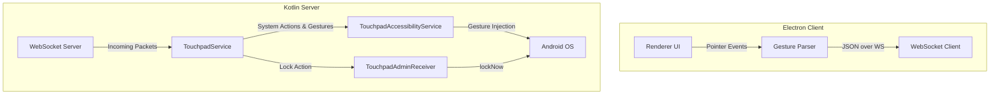

# Wireless Android Remote Touchpad System

A premium cross-platform wireless touchpad utility that lets you control an Android phone from a floating, glassmorphic desktop window over local Wi-Fi or hotspot.

---

## Architecture Overview



### Components

1. **Desktop Client (Electron)**
   - **Main Process (`main.js`)**: Manages a frameless, transparent, always-on-top window with customizable opacity.
   - **Preload Script (`preload.js`)**: Standard secure IPC bridge.
   - **Renderer (`renderer.js`)**: Captures mouse/touch pointer coordinates, performs gesture recognition, renders interactive glowing canvas-like ripples/trails, and runs the WebSocket client with auto-reconnection.
   - **UI (`index.html`, `style.css`)**: Modern macOS-style glassmorphic widget featuring custom titlebar/drag handle, opacity controls, IP configuration panel, connection status dot, and system buttons (Home, Back, Recents, Lock).

2. **Android Server (Kotlin)**
   - **MainActivity (`MainActivity.kt`)**: Displays the server status, active network IP, port configuration, and handles dynamic runtime permission setups.
   - **TouchpadService (`TouchpadService.kt`)**: Foreground Service running a WebSocket server (`org.java-websocket`). Displays a persistent notification to keep the network listener alive.
   - **TouchpadAccessibilityService (`TouchpadAccessibilityService.kt`)**: Accessibility service used to trigger system actions (`performGlobalAction`) and inject user events like taps, scroll, and drag paths (`dispatchGesture`).
   - **TouchpadAdminReceiver (`TouchpadAdminReceiver.kt`)**: Device Policy Administrator receiver used to lock the screen.

---

## Advanced Gesture & Pointer Controls

This system features premium, contextual input controls, including mouse multi-tap parsing and webcam-based AI hand tracking.

### 1. Contextual Touchpad Gestures
- **Dynamic Pointer Visibility:** The cursor pointer on the Android screen automatically disappears when the desktop client is disconnected and appears only when a connection is actively open.
- **Touchpad Tap & Drag Gestures:**
  - **Two Taps & Move:** Simulates moving the pointer cursor on the phone screen.
  - **Three Taps & Move:** Simulates scrolling the content up and down on the phone screen.

### 2. AI Air Gestures (Webcam-Based)
Toggle camera access in the desktop title bar to enable touch-free controls. The camera and tracking loop are **turned off by default**.

The system utilizes strict **Google MediaPipe Hands** pose classification to avoid gesture collisions:
* **Pointing Pose (Index finger extended, other fingers closed):**
  - **Scroll Down (Reveal lower content):** Swipe index finger UP.
  - **Scroll Up (Reveal higher content):** Swipe index finger DOWN.
* **Open Hand Pose (All fingers extended open):**
  - **Lock Screen:** Wave your open palm horizontally.
* **Pinch Pose (Index and Thumb tips touching):**
  - **Click:** Pinch your index finger and thumb tips together. (This is only checked when index finger is curved/folded, completely avoiding collisions with swipe down).
* **1.5s Resting Cooldown:** After triggering a gesture, a 1.5-second cooldown is enforced to let you return to a rest position. The status indicator displays `RESTING - hold position` in amber.

---

## Folder Structure

```text
Phone Scroller/
├── README.md                  # Complete documentation
├── desktop/                   # Electron desktop application
│   ├── package.json           # npm configuration and dependencies
│   ├── main.js                # Main Electron process
│   ├── preload.js             # IPC context bridge
│   ├── index.html             # UI layout and styling imports
│   ├── style.css              # Custom styling (glassmorphism, animations)
│   └── renderer.js            # Input capturing and WebSocket client logic
└── android/                   # Kotlin Android Studio project
    ├── build.gradle           # Top-level build config
    ├── settings.gradle        # Project settings
    ├── gradle.properties      # Build settings
    └── app/
        ├── build.gradle       # App-level dependencies & sdk configuration
        └── src/main/
            ├── AndroidManifest.xml
            ├── res/
            │   ├── drawable/
            │   │   └── ic_notification.xml
            │   ├── layout/
            │   │   └── activity_main.xml
            │   ├── values/
            │   │   ├── colors.xml
            │   │   ├── strings.xml
            │   │   └── themes.xml
            │   └── xml/
            │       ├── accessibility_service_config.xml
            │       └── device_admin_receiver.xml
            └── java/com/antigravity/phonescroller/
                ├── MainActivity.kt
                ├── TouchpadService.kt
                ├── TouchpadAccessibilityService.kt
                ├── TouchpadAdminReceiver.kt
                └── NetworkUtils.kt
```

---

## WebSocket Communication Protocol

All messages sent from the desktop client to the Android server are stringified JSON objects.

### 1. Tap Gesture
Fires a single tap. Coordinates are normalized values (floats between `0.0` and `1.0`) so the Android app can accurately map them onto screens of any resolution.
```json
{
  "type": "tap",
  "x": 0.475,
  "y": 0.320
}
```

### 2. Scroll Gesture
Represents relative drag movement on the touchpad for vertical or horizontal scrolling.
```json
{
  "type": "scroll",
  "dx": 0.0,
  "dy": -120.0
}
```

### 3. Swipe / Drag Gesture
Draws a line gesture from start to end coordinates over a specific time duration (in milliseconds).
```json
{
  "type": "swipe",
  "startX": 0.8,
  "startY": 0.5,
  "endX": 0.2,
  "endY": 0.5,
  "duration": 300
}
```

### 4. System Action Commands
Trigger Android global system keys:
* **Back:** `{"type": "back"}`
* **Home:** `{"type": "home"}`
* **Recent Apps:** `{"type": "recents"}`
* **Lock Device:** `{"type": "lock"}`

---

## Android Permission Configuration Guide

For the application to function correctly, three system permissions must be configured on the phone:

1. **Accessibility Service**:
   * **Why**: Required to trigger system navigation (Home, Back, Recents) and perform gesture emulation (`dispatchGesture`).
   * **How**: Open the app and click **Enable Accessibility Service**. Scroll to "Installed Services" or "Downloaded Apps", tap **Phone Scroller**, and toggle the switch to **On**.

2. **Device Administrator**:
   * **Why**: Required to lock the device screen immediately when requested via the API.
   * **How**: Click **Enable Device Admin** within the app interface. This will open the system confirmation window. Click **Activate this device admin app**.

3. **Notification Permission (Android 13+)**:
   * **Why**: Required to display the foreground service persistent notification, which keeps the WebSocket server active in the background.
   * **How**: The app will request this automatically when you toggle the server on for the first time. Tap **Allow**.

---

## Build & Execution Instructions

### 1. Running the Desktop Application (Electron)

#### Prerequisites
Make sure you have [Node.js](https://nodejs.org/) installed.

#### Run Steps
1. Navigate to the `desktop` folder:
   ```bash
   cd desktop
   ```
2. Install dependencies:
   ```bash
   npm install
   ```
3. Launch the application:
   ```bash
   npm start
   ```

---

### 2. Building & Running the Android Application

#### Prerequisites
* [Android Studio (Hedgehog or newer recommended)](https://developer.android.com/studio)
* JDK 17 installed and configured.

#### Build Steps (Command Line)
1. Navigate to the `android` folder:
   ```bash
   cd android
   ```
2. Build the debug APK:
   ```bash
   # Windows PowerShell
   .\gradlew.bat assembleDebug

   # macOS / Linux
   chmod +x gradlew
   ./gradlew assembleDebug
   ```
3. The compiled APK will be located at:
   `android/app/build/outputs/apk/debug/app-debug.apk`

#### IDE Deployment (Recommended)
1. Open Android Studio and choose **Open an Existing Project**.
2. Select the `android` directory.
3. Allow Gradle sync to complete.
4. Connect your Android device via USB/Wi-Fi and click **Run (Green Play Button)**.

---

## Usage Guide

1. Ensure both your computer and Android device are connected to the **same local Wi-Fi network**. Alternatively, enable **Wi-Fi Hotspot** on your phone and connect your computer to that hotspot.
2. Launch the Android app, grant the required permissions, set the port (default `8080`), and click **Start Server**. Note the displayed local IP address.
3. Start the Electron app on your desktop.
4. Click the **Gear (Settings)** icon to slide open the settings panel.
5. Enter the **IP Address** and **Port** of your Android device, then click **Connect**.
6. Hover over the touchpad surface to start scrolling or swiping. Clicking inside the surface will tap the corresponding area on the mobile device. Click the buttons on the bottom row to perform actions like Home, Back, Recents, and Screen Lock.
